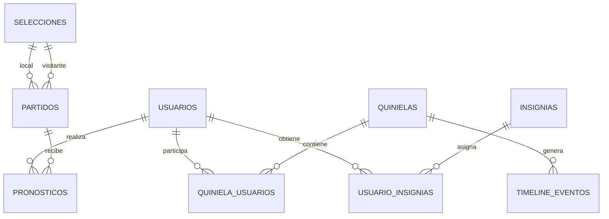

# Diagrama relacional V2

```mermaid
erDiagram
    USUARIOS ||--o{ PRONOSTICOS : realiza
    PARTIDOS ||--o{ PRONOSTICOS : recibe
    SELECCIONES ||--o{ PARTIDOS : local
    SELECCIONES ||--o{ PARTIDOS : visitante
    USUARIOS ||--o{ QUINIELA_USUARIOS : participa
    QUINIELAS ||--o{ QUINIELA_USUARIOS : contiene
    QUINIELAS ||--o{ TIMELINE_EVENTOS : genera
    USUARIOS ||--o{ USUARIO_INSIGNIAS : obtiene
    INSIGNIAS ||--o{ USUARIO_INSIGNIAS : asigna
```
